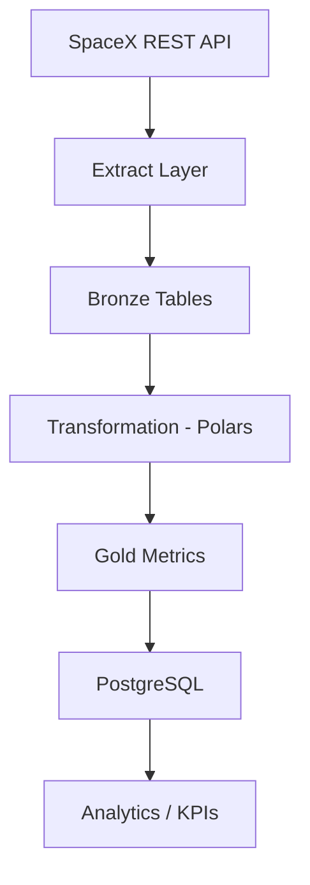

# SpaceX ETL Pipeline


Production-ready ETL pipeline that extract launch data from the SpaceX public API, transfoorms it using a high-performace DataFrame engenie, and loads it into PostgreSQL  with idempontent upserts.

Designed to simulate a real-world data engineering environment with orchestration containerization, automated testing, and CI integration. 

## Project Overview 

This project implements a modular ETL architeture structured for maintainability, reproducibility, and production-grade realibility.

Key enginerring pronciples:

- Idempontent data loads using 'ON CONFLICT'
- Modular extract/transform/load layers 
- Workflow orchestration with Prefect 3
- Containerized infrastructure via Docker Compose 
- Automated testing with Pytest
- CI pipeline with GitHub Actions 
  
## Architecture (Medallion Pattern)


The pipeline follows a layered architecture:

- **Bronze Layer**  
  Raw ingestion from SpaceX API (launches, rockets, payloads, launchpads).

- **Gold Layer**  
  Aggregated cost-efficiency metrics computed from normalized data.

This structure simulates a production-grade medallion architecture commonly used in modern data platforms.

###  Fault Tolerance

The Prefect flow is configured with automatic retries to handle transient API or database failures.

- 5 retries
- 15-second delay between attempts

### Project structure:
```Bash 
src/
├── config/
├── database/
├── extract/
├── transform/
├── load/
├── flows/
├── utils/
```

## Tech Stack

| Technology              | Purpose                                    |
| ----------------------- | ------------------------------------------ |
| Python 3.11             | Core language                              |
| Polars                  | High-performance DataFrame transformations |
| Prefect 3.6.17          | Workflow orchestration                     |
| PostgreSQL              | Relational data storage                    |
| SQLAlchemy              | Database interaction and upserts           |
| Docker & Docker Compose | Containerized reproducibility              |
| Pytest                  | Automated testing                          |
| GitHub Actions          | Continuous Integration                     |


### Why Polars intead of Pandas?

Polars provides better performance and memory effiiciency, especially for trannsformation-heavy workloads. It's optimized in Rust and defigned for parallel execution.

### Why Prefect instead of Cron?

Prefect provides orchestration, retries, looging, observability, ad floww-level control, essential features in real productuion pipelines.

### Why UPSERT?
 
Using `ON CONFLICT DO UPDATE` guarantees idempontency. Re-runnung the pipeline won't duplicate data. 

## Data Flow 

1. Extract launch data from  SpaceX API
2. Normalize and transform data using Polars
3. Load into PostgreSQL using idempotent upsert strategy 
4. Compute aggregated KPIs in the gold layer
   
## How to Run 

### 1.  Clone the repository

```Bash 
git clone https://github.com/RicsonRamos/spacex_etl_pipeline.git
cd spacex_etl_pipeline
```

### 2. Configurate environment variables 
creat a `.env` file with:

```bash
POSTGRES_USER=postgres
POSTGRES_PASSWORD=postgres
POSTGRES_DB=spacex
POSTGRES_HOST=db
POSTGRES_PORT=5432
```

### 3. Start Services

```bash
docker-compose up --build
```
The pipeline will execute via Prefect flow

## Running Tests
```bash
pytest
```
Test coverge includes:
- API extraction
- Data transformation
- Database loading
- Connection validation
- Gold KPI calculations

## Idempotency Strategy 

Data loading uses PostgreSQL's `ON CONFLICT DO UPDATE` clause to ensure deterministic reprocessing.

Primary keys enforce entity uniqueness and guarantee:

- Safe reruns
- No duplicate records
- Consistent state after failures

This allows the pipeline to be executed multiple times without compromising data integrity.

## Example Output 
(After running the pipelie)

`SELECT COUNT(*) FROM bronze_launches;`

Output:

```bash
 count
-------
 410
 ```
Gold aggregation: 

 `SELECT COUNT(*) FROM gold_cost_efficiency_metrics;`

 Output:

```bash
 count
-------
 4
```
## This confirms:
-  Successful ingestion from SpaceX API
-  Proper bronze Layer persistence
-  Gold-layer KPI aggregation


## CI Pipeline 

GitHub Actions automatically runs:

- Lint checks 
- Unit tests
- Build validation

Ensurig code quality before merge 

## Features Improvements

- Data validation with Great Expectations
- Observability metrics with Prometheus 
- Deployment to cloud (ECS / GCP Cloud Run)
- Incremental exxtraction strategy 
- Data partitioning for scalability

## Engineering Considerations

- Deterministic reprocessing via UPSERT
- Layered medallion architecture
- Containerized reproducibility
- Automated CI validation
- Modular codebase with separation of concerns
  
# Lincese 